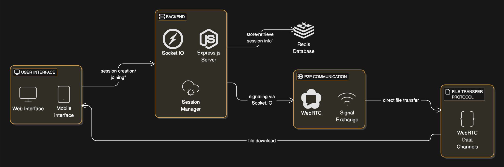

# QuickDrop - File Transfer Application

QuickDrop is a secure, fast, and serverless file transfer application built with React, Vite, and WebRTC. It allows users to transfer files directly between devices without uploading them to a server, ensuring privacy and efficiency.

## Features

- **Serverless File Transfer**: Files are transferred directly between devices using WebRTC.
- **Secure**: End-to-end encryption ensures your files remain private.
- **Fast**: Peer-to-peer connections enable high-speed file transfers.
- **Cross-Platform**: Works on any device with a modern web browser.
- **Simple UI**: Intuitive interface for creating and joining transfer sessions.

## Architecture diagram


## Getting Started

### Prerequisites

- Node.js (v16 or higher)
- npm or yarn

### Installation

1. Clone the repository:
   ```bash
   git clone https://github.com/your-username/quickdrop.git

   cd quickdrop/client