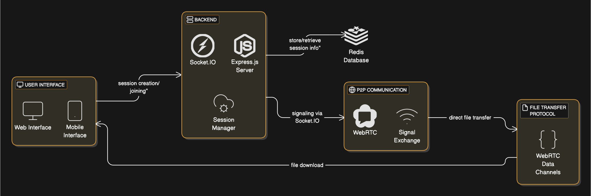

# QuickDrop

QuickDrop is a secure, fast, and serverless file transfer application. It enables direct file sharing between devices using WebRTC, ensuring privacy and efficiency without relying on centralized servers.

## Features

- **Serverless File Transfer**: Files are transferred directly between devices using WebRTC.
- **Secure**: End-to-end encryption ensures your files remain private.
- **Fast**: Peer-to-peer connections enable high-speed file transfers.
- **Cross-Platform**: Works on any device with a modern web browser.
- **Simple UI**: Intuitive interface for creating and joining transfer sessions.

## Architecture

QuickDrop consists of two main components:
1. **Client**: A React-based web application for users to create and join file transfer sessions.
2. **Server**: A Node.js server that facilitates WebRTC signaling and session management using Socket.io and Redis.

## Architecture Diagram



## Prerequisites

- Node.js (v16 or higher)
- Redis server
- MongoDB (optional, for database integration)

## Installation

### Server Setup

1. Navigate to the `server` directory:
   ```bash
   cd server
   ```

2. Install dependencies:
   ```bash
   npm install
   ```

3. Configure environment variables:
   Create a `.env` file in the `server` directory and add the following:
   ```
   HOST=localhost
   PORT=3000
   REDIS_USERNAME=default
   REDIS_HOST=localhost
   REDIS_PORT=6379
   REDIS_PASSWORD=
   ```

4. Start the server:
   ```bash
   npm start
   ```

### Client Setup

1. Navigate to the `client` directory:
   ```bash
   cd client
   ```

2. Install dependencies:
   ```bash
   npm install
   ```

3. Configure environment variables:
   Create a `.env` file in the `client` directory and add the following:
   ```
   VITE_SIGNALING_SERVER_URL=http://localhost:3000
   ```

4. Start the client:
   ```bash
   npm run dev
   ```

5. Open your browser and navigate to `http://localhost:5173`.

## Usage

1. **Create a Session**: Upload a file and generate a unique session code.
2. **Join a Session**: Enter the session code to connect with the sender.
3. **Transfer Files**: Files are transferred directly between devices.